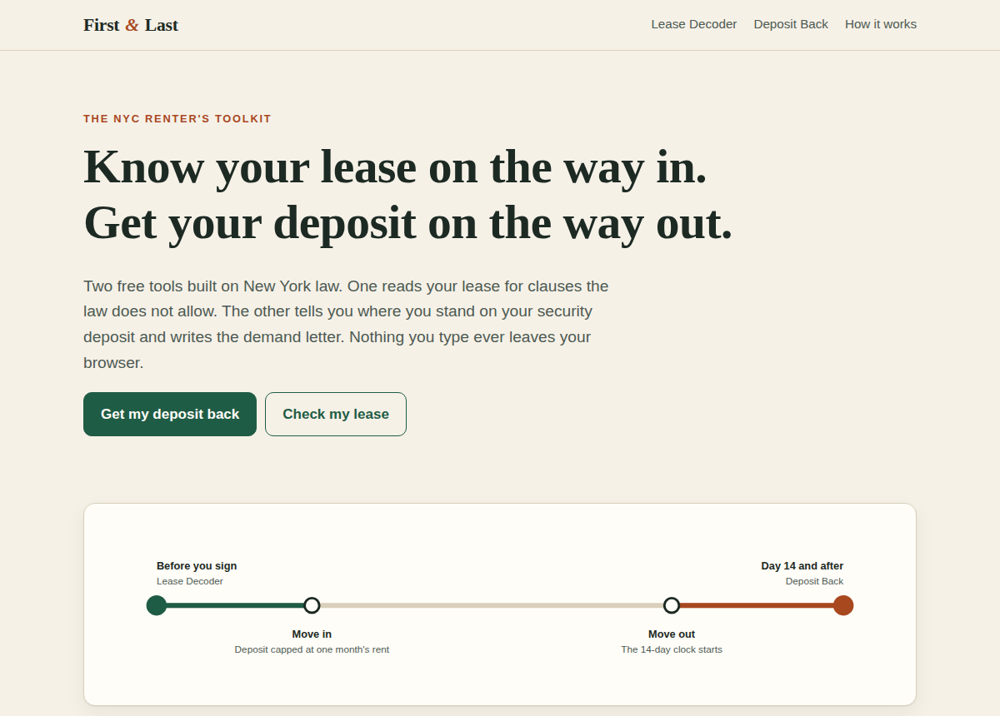
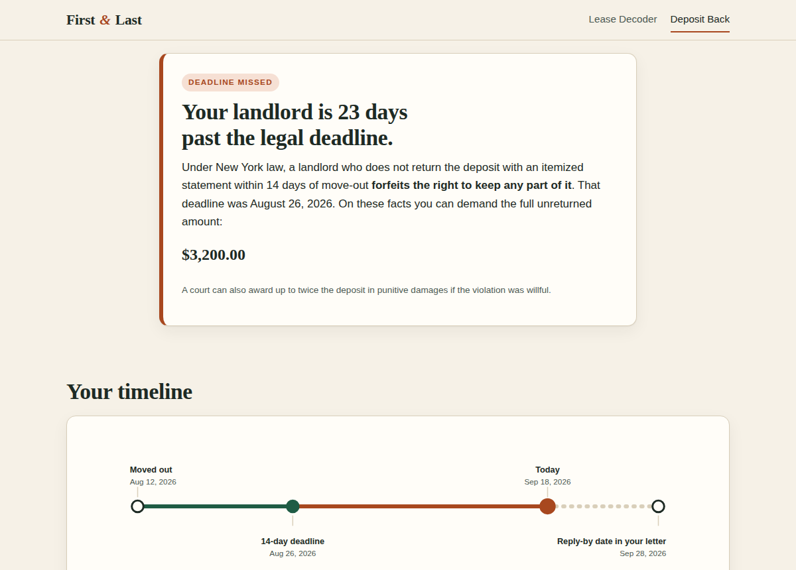
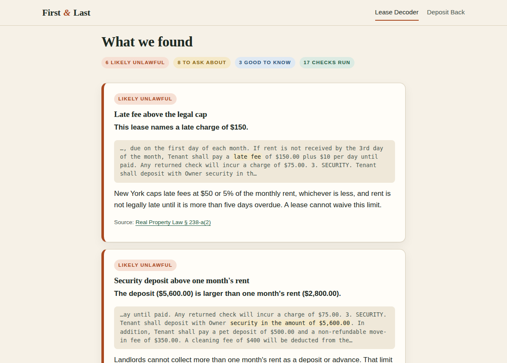

# First & Last

**The NYC renter's toolkit.** Check your lease on the way in. Get your security deposit back on the way out.

Live site: _add your GitHub Pages link here after publishing_



## The problem

New York rewrote its tenant protections in 2019, and most renters still do not know the rules that now favor them. Two moments cost renters the most money:

1. **Signing.** Leases routinely include late fees above the legal cap, deposits above one month's rent, and waivers that courts will not enforce. Renters sign them because they have no fast way to check.
2. **Moving out.** Landlords have 14 days to return a deposit with an itemized statement or they forfeit the right to keep any of it ([GOL § 7-108](https://www.nysenate.gov/legislation/laws/GOB/7-108)). The NY Attorney General has received nearly 5,000 deposit complaints since 2023 ([City Limits](https://citylimits.org/trouble-getting-your-security-deposit-back-this-app-could-help/)).

## The product

| Tool | Moment | What the renter gets |
| --- | --- | --- |
| **Lease Decoder** | Before signing | 17 rule-based checks against NY statutes, each with the matched lease text, a plain-English explanation, and a link to the law. Plus a scan for 6 required riders and notices. |
| **Deposit Back** | After move-out | A verdict on the 14-day deadline, a visual timeline, an editable demand letter citing the statute, and a small claims plan. |

Both tools run entirely in the browser. Nothing a renter types is uploaded or stored on a server. That is a product decision as much as a technical one: a lease contains names, addresses, and rent figures, and competing tools ask renters to upload it.





## Product thesis

The free letter and the free lease check are commodities. Free competitors already exist for each. The bet is on two things they do not offer:

- **The lifecycle.** The same renter meets the product at move-in and again at move-out. Move-in photos prompted by the Lease Decoder become evidence in Deposit Back.
- **Paid follow-through.** The steps where renters stall are mailing the letter with proof of delivery and preparing for small claims court. Those are the paid offers being tested.

## What is being tested

The paid offers on the site are **fake doors**: buttons that measure intent before the service exists. A click opens a plain notice that the service is not live yet and invites an email signup. Nothing is charged.

| Assumption | Signal | Pass line |
| --- | --- | --- |
| Renters with a deposit problem will finish the flow | Completed letters / Deposit Back visitors | 40% or more |
| Some will pay for follow-through | Paid-offer clicks / completed letters | 10% or more |
| Intent is real, not curiosity | Emails left / paid-offer clicks | 30% or more |
| Move-in is a second entry point | Lease scans on real (non-sample) text | 15 or more in the test week |

## How it is built

Plain HTML, CSS, and JavaScript. No frameworks, no build step, no backend, no cookies.

```
index.html          Home page and lifecycle diagram
deposit.html        Deposit Back
lease.html          Lease Decoder
css/styles.css      One stylesheet, light and dark themes
js/app.js           Config, event tracking, fake-door modal, helpers
js/deposit.js       Deadline logic, SVG timeline, letter templates
js/lease.js         The rule engine: 17 checks and 6 rider scans
```

To run it, open `index.html` in a browser. To publish it, push to GitHub and turn on GitHub Pages.

Two values in `js/app.js` connect the site to the outside world, and both are empty by default: `FORM_ENDPOINT` (where notify-me emails go) and `GOATCOUNTER_CODE` (cookie-free analytics).

## Known limits

- The Lease Decoder matches text patterns. It will miss problems phrased in unusual ways and can flag clauses that are fine in context. Results are labeled "likely unlawful," "ask about this," or "good to know" to reflect that.
- Scanned PDFs have no selectable text. OCR is out of scope for this version.
- Coverage is New York State law and New York City rules as of September 2026.
- Rent-stabilized deposit timing is treated conservatively because sources differ. See the legal research memo in the sprint documentation.

## Backlog

- [ ] Wire `FORM_ENDPOINT` and analytics before the test week
- [ ] PDF upload with in-browser text extraction
- [ ] Generate a "request for changes" email from Lease Decoder findings
- [ ] Spanish version
- [ ] Borough-specific small claims filing details

## Disclaimer

First & Last provides legal information and self-help document tools. It is not a law firm, does not give legal advice, and using it does not create an attorney-client relationship.

## License

MIT
